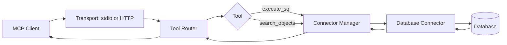
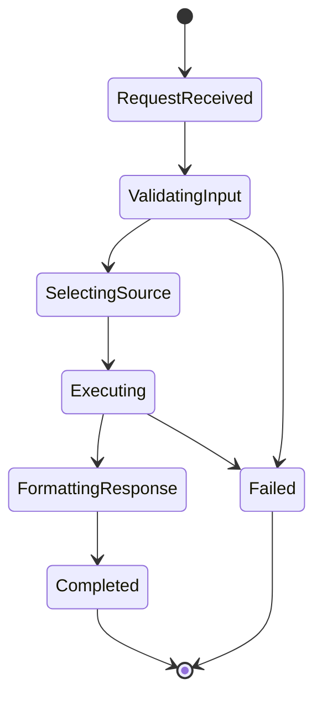

# Electric Elephant

Electric Elephant is a token-efficient MCP server for exploring and querying SQL databases from MCP-capable clients.

Repository: [github.com/ajgreyling/electric-elephant](https://github.com/ajgreyling/electric-elephant)

## Purpose

- Expose database access through MCP tools.
- Support PostgreSQL databases.
- Provide safe defaults (read-only unless explicitly enabled for destructive SQL).
- Heuristic PII/clinical guard on `execute_sql` (wildcards and sensitive-looking columns blocked unless explicitly opted in via TOML, env, or CLI — see `docs/tools/execute-sql.mdx` and `CLAUDE.md`).

## Repository Landmarks

- `src/index.ts` - entrypoint and startup path.
- `src/server.ts` - HTTP MCP transport wiring.
- `src/connectors/` - database connector implementations.
- `src/tools/` - MCP tool handlers (`execute_sql`, `search_objects`).
- `src/config/` - TOML/config loading and validation.
- `frontend/` - local web workbench UI.
- `CLAUDE.md` - architecture and development conventions.

## Quick Start

```bash
pnpm install
pnpm run dev
```

Build and test:

```bash
pnpm run build
pnpm test
```

## MCP Request Flow



## Query Execution State Machine



## Human + AI Agent Onboarding Checklist

1. Read `CLAUDE.md` before editing connectors/tools.
2. Prefer tool-level changes in `src/tools/` over transport-layer changes.
3. Keep `source_id` routing behavior backward compatible.
4. When changing `execute_sql`, preserve PII guard semantics (`pii-sql-guard.ts`, `pii-heuristics.ts`, `PII_ACCESS_VIOLATION`).
5. Run relevant tests (`pnpm test`, or targeted connector/integration tests).

## Tool Schema Examples

`execute_sql` input (list explicit columns; `SELECT *` may be rejected when the PII guard is on):

```json
{
  "sql": "SELECT id, status FROM users LIMIT 10;"
}
```

`search_objects` input:

```json
{
  "object_type": "column",
  "schema": "public",
  "table": "users",
  "pattern": "%_id",
  "detail_level": "summary",
  "limit": 50
}
```

## Related Docs

- `docs/` for user-facing documentation.
- `dbhub.toml.example` for multi-source configuration examples.

