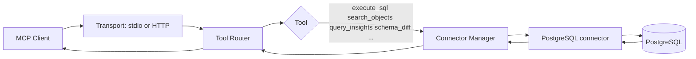
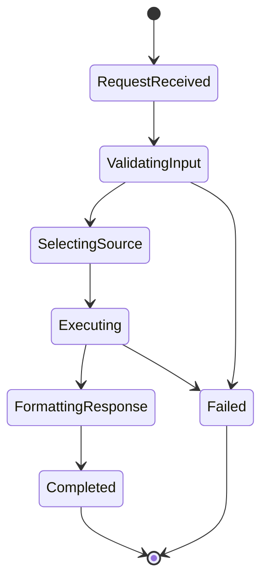

# Electric Elephant

<p align="center">
  
</p>

Electric Elephant is a token-efficient MCP server for exploring and querying **PostgreSQL** from MCP-capable clients. It is **not** a generic SQL bridge: only PostgreSQL is supported (not MySQL, SQLite, SQL Server, Oracle, or other engines).

Repository: [github.com/ajgreyling/electric-elephant](https://github.com/ajgreyling/electric-elephant)

## Purpose

- Expose PostgreSQL through MCP tools (`execute_sql`, `search_objects`, `query_insights`, `schema_diff`, observability helpers, and related wiring).
- PostgreSQL-only: no connectors or compatibility layers for other SQL databases.
- Provide safe defaults (read-only unless explicitly enabled for destructive SQL).
- Heuristic PII/clinical guard on `execute_sql` (wildcards and sensitive-looking columns blocked unless explicitly opted in). Opt-in: TOML `allow_access_to_pii_data` on `execute_sql`, env `ALLOW_ACCESS_TO_PII_DATA`, CLI `--allow-access-to-pii-data=true`, or **for local debugging** bare `--disable-pii-guard` (or `=true` / `1` / `yes`; single-DSN mode only). Covers HL7v2/FHIR/LOINC/SNOMED-style clinical identifiers. See `docs/tools/execute-sql.mdx`, `docs/config/command-line.mdx`, and `CLAUDE.md`.

## Repository Landmarks

- `src/index.ts` - entrypoint and startup path.
- `src/server.ts` - HTTP MCP transport wiring.
- `src/connectors/` - database connector implementations.
- `src/tools/` - MCP tool handlers (`execute_sql`, `search_objects`, `query_insights`, `schema_diff`, etc.).
- `src/config/` - TOML/config loading and validation.
- `frontend/` - local web workbench UI.
- `CLAUDE.md` - architecture and development conventions.

## Quick Start

```bash
pnpm install
pnpm run dev
```

Build and test:

```bash
pnpm run build
pnpm test
```

## MCP Request Flow



All built-ins (including read-only diagnostics such as `explain_plan`, `diagnose_locks`, and `replication_status`) route through the connector manager to the same PostgreSQL connection pool for the selected source.

## Built-in MCP tools

These tools are enabled by default per `[[sources]]` entry unless you whitelist a subset with `[[tools]]` in `dbhub.toml`. With multiple sources, names are suffixed with the source id (for example `execute_sql_prod_pg`).

| Tool | Role |
|------|------|
| `execute_sql` | Run SQL (multi-statement supported); PII/clinical guard on by default (opt out via TOML/env/CLI; debug: `--disable-pii-guard` in single-DSN mode); standards-aware profiles (`hl7v2`, `fhir`, `loinc`, `snomed`) |
| `search_objects` | Discover schemas, tables, columns, indexes, routines (progressive detail) |
| `query_insights` | Ranked statements from `pg_stat_statements` when available |
| `schema_diff` | Compare schema metadata between two configured sources |
| `explain_plan` | Structured `EXPLAIN (FORMAT JSON, …)` for one read-only statement |
| `diagnose_locks` | Blocking / waiting sessions from `pg_stat_activity` |
| `replication_status` | Replication lag, streaming clients, slots |
| `table_health` | Dead tuples, vacuum/analyze stats, relation sizes |
| `extensions_status` | Installed extensions and `pg_stat_statements` readiness |

User-defined **`[[tools]]`** entries add custom parameterized SQL tools. See `docs/tools/overview.mdx` and `dbhub.toml.example`.

## Query Execution State Machine



## Human + AI Agent Onboarding Checklist

1. Read `CLAUDE.md` before editing connectors/tools.
2. Prefer tool-level changes in `src/tools/` over transport-layer changes.
3. Keep `source_id` routing behavior backward compatible.
4. When changing `execute_sql`, preserve PII guard semantics (`pii-sql-guard.ts`, `pii-heuristics.ts`, `PII_ACCESS_VIOLATION`).
5. Run relevant tests (`pnpm test`, or targeted connector/integration tests).

## Tool Schema Examples

`execute_sql` input (list explicit columns; `SELECT *` may be rejected while the PII guard is active—disable only with explicit policy: TOML, `ALLOW_ACCESS_TO_PII_DATA`, `--allow-access-to-pii-data=true`, or `--disable-pii-guard` for debugging):

```json
{
  "sql": "SELECT id, status FROM users LIMIT 10;"
}
```

`search_objects` input:

```json
{
  "object_type": "column",
  "schema": "public",
  "table": "users",
  "pattern": "%_id",
  "detail_level": "summary",
  "limit": 50
}
```

## Related Docs

- [`docs/tools/overview.mdx`](docs/tools/overview.mdx) — all MCP tools and TOML whitelisting.
- [`docs/tools/execute-sql.mdx`](docs/tools/execute-sql.mdx) — `execute_sql`, read-only mode, PII guard.
- [`docs/config/command-line.mdx`](docs/config/command-line.mdx) — CLI flags including `--disable-pii-guard` and `--allow-access-to-pii-data` (single-DSN).
- [`docs/tools/search-objects.mdx`](docs/tools/search-objects.mdx) — `search_objects` patterns and detail levels.
- [`docs/tools/query-insights.mdx`](docs/tools/query-insights.mdx) — `query_insights` and `pg_stat_statements`.
- [`docs/tools/schema-diff.mdx`](docs/tools/schema-diff.mdx) — `schema_diff` between two sources.
- [`docs/tools/custom-tools.mdx`](docs/tools/custom-tools.mdx) — parameterized custom tools.
- [`dbhub.toml.example`](dbhub.toml.example) — multi-source and tool configuration examples.
- Mintlify site config: [`docs/docs.json`](docs/docs.json).

