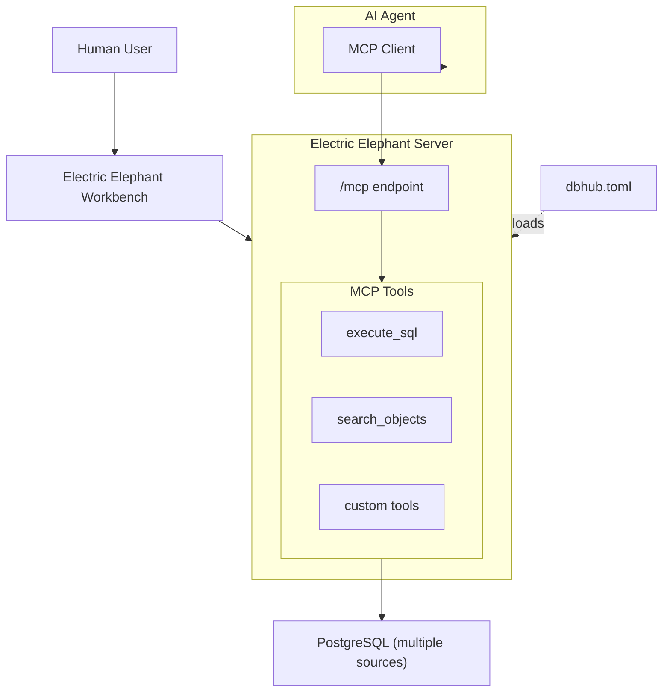

Electric Elephant is a zero-dependency, token efficient MCP server implementing the Model Context Protocol server interface. This lightweight gateway lets MCP-compatible clients connect to **PostgreSQL** — one engine, consistent behavior.

```
 +------------------+    +--------------+    +------------------+
 |                  |    |              |    |                  |
 |  Claude Desktop  +--->+              +--->+                  |
 |  Claude Code     +--->+ Elephant MCP +--->+   PostgreSQL     |
 |  Cursor          +--->+              +--->+   (one or more   |
 |  VS Code         +--->+              +--->+    sources)      |
 |  Other Clients   +--->+              +--->+                  |
 +------------------+    +--------------+    +------------------+
     MCP Clients           MCP Server             Database
```

## Supported database

PostgreSQL only (`postgres://` / `postgresql://`, or TOML / `DB_*` parameters).

## Why Electric Elephant?

Electric Elephant brings database access to AI coding assistants with guardrails suited to agents:

- **Local development first**: Token-efficient tools and a small surface area
- **PostgreSQL-native**: One dialect, one connector — less ambiguity for models and operators
- **Multi-connection**: Several Postgres instances via `dbhub.toml` (`source_id` on tools)
- **Guardrails**: Read-only mode, row limiting, **5-minute default** query timeout (override with `query_timeout` in TOML), mandatory single-schema scope on every row-returning tool, and hard exclusion of health/clinical data + personal identifiers + wildcards on `execute_sql` (only the mobile-number username is unblockable via `allow_access_to_pii_data`)
- **Secure Access**: SSH tunneling and SSL/TLS encryption

## Key Features

### MCP Tools

Electric Elephant provides AI assistants with direct database access through three core tools:
- **[execute_sql](/tools/execute-sql)**: Run queries with transaction support and safety controls
- **[search_objects](/tools/search-objects)**: Explore schemas, tables, columns, indexes, and procedures
- **[Custom Tools](/tools/custom-tools)**: Define reusable, parameterized SQL operations

### Workbench

A [web-based interface](/workbench/overview) for running database tools and viewing request traces without requiring an MCP client.

## Architecture



Electric Elephant acts as a gateway between databases and AI agents. AI agents access databases through the `/mcp` endpoint using MCP tools, while the Workbench provides direct browser-based access for humans.

## Getting Started

<CardGroup cols={2}>
  <Card title="Installation" icon="download" href="/installation">
    Install Electric Elephant using Docker, NPM, or pre-built binaries
  </Card>

  <Card title="Quickstart" icon="rocket" href="/quickstart">
    Get Electric Elephant running with your first database connection
  </Card>
</CardGroup>